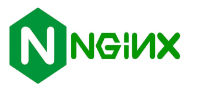
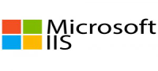

# Deliverable 1
---

## Questions 
- What is a web server? (In the context of software Ex. *Apache*)

Web server software is the program that **stores, processes, and delivers website content** to users over the internet. It runs on a computer and uses the Hypertext Transfer Protocol (HTTP) to respond to requests from web browsers, sending back files like HTML, images, and videos. Examples of web server software include Apache, Nginx, and Microsoft IIS. 

- What are some different web server applications? Include definitions, project’s website/where to download it, which operating system is available for and its latest version.

##### Application # 1
**Apache**

The Apache HTTP Server Project is an effort to develop and maintain an open-source HTTP server for modern operating systems including UNIX and Windows. The goal of this project is to provide a secure, efficient and extensible server that provides HTTP services in sync with the current HTTP standards.

The Apache HTTP Server ("httpd") was launched in 1995 and it has been the most popular web server on the Internet since April 1996.

- Website: Application site **[here](https://httpd.apache.org/)**
- Available for: **Linux, Windows, macOS and Unix-like Systems.**
- Latest version: **2.4.65**
-------
##### Application # 2
**Nginx**

NGINX is a high-performance web server software used for web serving, reverse proxying, and load balancing. It efficiently handles a high volume of simultaneous connections due to its asynchronous, event-driven architecture, making it suitable for modern web applications and APIs.

- Website: Application site **[here](https://nginx.org/en/)**
- Available for: **Linux, Windows, macOS, FreeBSD, Solaris and more.**
- Latest Version: **1.29.3**
-----
##### Application # 3
**Microsoft Internet Information Services (IIS)**

LiteSpeed Web Server (LSWS) is a high-performance, proprietary web server that acts as a drop-in replacement for Apache, offering improved speed, scalability, and security. Its event-driven architecture is efficient, handling many concurrent users with minimal resource usage, while built-in features like anti-DDoS tools and a caching engine further enhance performance. It is known for being easy to migrate to from Apache and is compatible with common control panels like cPanel.

- Website: Application site **[here](https://www.litespeedtech.com/)**
- Available for: **Linux, macOS, FreeBSD and Solaris.**
- Latest Version: **6.3**
-----
- What is virtualization?
Virtualization is the process of creating a virtual, software-based version of physical IT resources, such as servers, storage, networks, or operating systems. It uses software to abstract these resources, allowing multiple virtual environments to run on a single physical machine, which increases efficiency and allows for better resource utilization.

- What is virtualbox?
VirtualBox is a free, open-source virtualization software that allows you to create and run virtual machines (VMs) on your computer, effectively letting you run multiple operating systems on a single machine. It's used for tasks like testing software, experimenting with different operating systems, or creating isolated, secure environments for development and other work. 

- What is a virtual machine?
A virtual machine (VM) is a software-based simulation of a computer that runs on a physical host machine. It functions as a self-contained computer with its own operating system (guest OS) and applications, allowing multiple VMs to run on a single physical server by using a hypervisor to manage resource allocation. 

- In the context of virtualization, what does host machine and guest machine mean?
A **host machine** is the physical computer or server that provides the resources (like CPU, memory, and storage) to run virtual machines, while a **guest machine** is the virtual machine itself that operates on top of the host. 

- What is Debian?
Debian is a free, open-source operating system based on the Linux or FreeBSD kernel, known for its stability, reliability, and large software repository. It is community-driven and supports a wide range of uses, from personal desktops to enterprise servers. Debian is also a parent distribution for many other Linux versions, like Ubuntu. 

- What is a firewall?
A firewall is a network security system that monitors and controls incoming and outgoing internet traffic based on predetermined security rules. It acts as a barrier between a private network and external networks, like the internet, by blocking unauthorized access while permitting legitimate communication. Firewalls can be implemented as either software on individual devices or as dedicated hardware devices for an entire network. 

- What is SSH?
SSH, or Secure Shell, is a network protocol that creates a secure, encrypted connection between two computers over an unsecured network, like the internet. It allows users to remotely access, manage, and transfer files to a server or other machine in a secure way, and is a secure replacement for older, unencrypted protocols like Telnet. 

- What is an IP Address?
An IP (Internet Protocol) address is a unique numerical label assigned to every device connected to a computer network that uses the Internet Protocol for communication. It functions like a home address, allowing data to be sent and received between devices on the internet or on a local network. IP addresses enable devices to identify and communicate with each other, ensuring data is sent to the correct destination. 

- What is a network mask?
A network mask is a 32-bit number, often written in dotted-decimal format (for example `255.255.255.0`, that divides an IP address into two parts: the network address and the host address. This division is crucial for network operation, as it helps devices determine if another IP address is on the same network or a different one, enabling proper routing and communication. 

- What is a port? (in the context of networking/computers)
In networking, a port is a virtual communication endpoint that identifies a specific process or service on a computer. It is a number from 0 to 65,535 that, when paired with an IP address, directs internet traffic to the correct application, like a web browser or email client. Think of the IP address as a building's street address and the port number as the apartment number inside. 

- What is port forwarding?
Port forwarding is a network technique that redirects incoming internet traffic from a router's public IP address and a specific port to a device on a private network, allowing external access to services on that device. It's like creating a specific "door" on your router's firewall to let certain data through to a device like a security camera or a gaming console. This is necessary because your router's security, known as network address translation (NAT), normally blocks unsolicited incoming connections to your private network. 

- What is localhost? (in the context of networking/computers)
Localhost is a reserved domain name and IP address that refers to the current computer, allowing you to access services and applications running on it. It is used primarily for testing and development, as it lets you run and test applications locally without needing an internet connection or a public server. 

- What does this ip address represent 127.0.0.1?
`127.0.0.1` is a loopback IP address, commonly called "localhost," that allows a computer to communicate with itself over a network. This is useful for testing and developing applications locally without needing an external network connection, as all data sent to this address is routed back to the originating computer. It is a standard and reserved address, meaning it is used by every computer with an IPv4 address to refer to the local machine. 

- What is Git?
Git is a free and open-source distributed version control system (DVCS) designed to manage and track changes in source code during software development. It enables individuals and teams to collaborate on projects efficiently and effectively. 

- What is GitHub?
GitHub is a cloud-based platform for hosting and collaborating on code using Git, a version control system. It provides a user-friendly web interface for developers to store code in repositories, track changes, manage projects, and work together on software from anywhere.

##### Terms I did not understand
- Port forwarding:
Port forwarding is a **network trick** that tells your router to send incoming internet traffic for a specific "port" (like a digital doorway) to a particular device (like a game console or server) inside your private home network, bypassing the router's default security to allow remote access for things like gaming, security cameras, or hosting servers. It acts like a receptionist directing a specific caller (internet traffic) to the right person (device) in the office (your network) by mapping external requests to internal IP addresses and ports. 

-Bridge Network Adapter:
A bridged network adapter is a virtual machine (VM) setting that connects the VM directly to the physical network, making it appear as a separate, independent device on the same network as the host computer, getting its own IP address from the router, similar to plugging another physical PC into the network. It uses the host's network adapter but spoofs a unique MAC address, allowing the VM full access to the network and the ability to be seen by other devices, unlike NAT which hides the VM behind the host. 