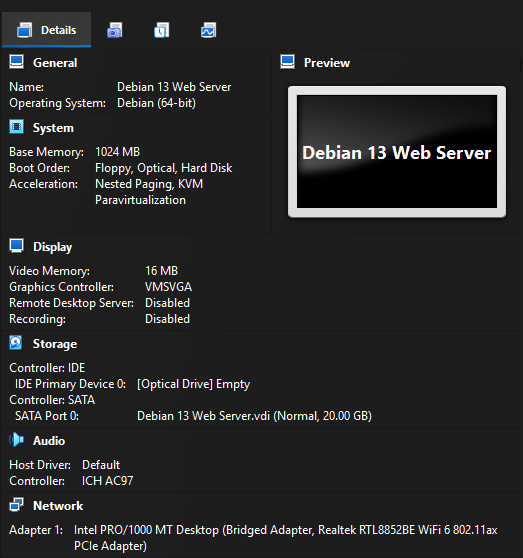
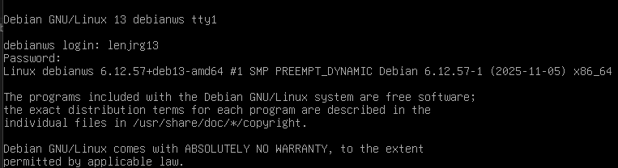
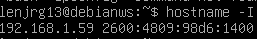
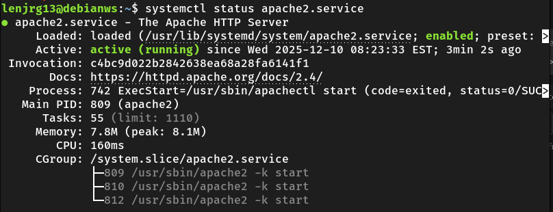
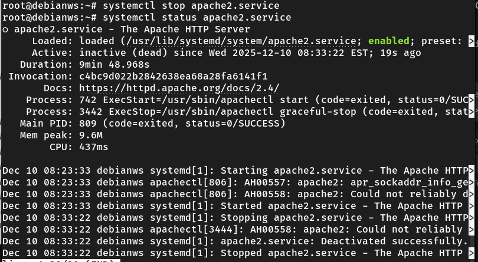
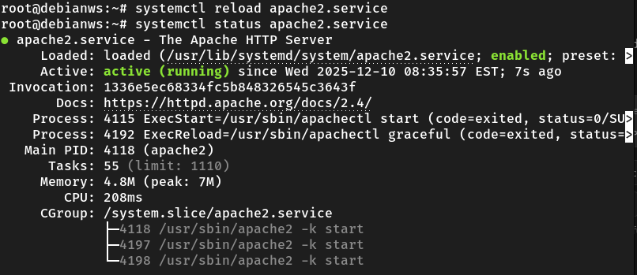
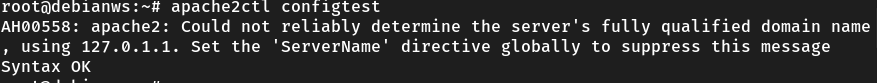
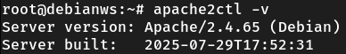
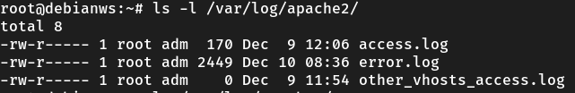
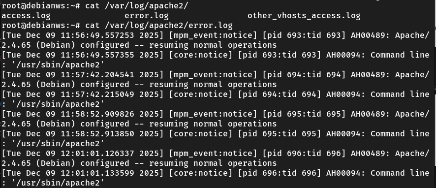

# Deliverable 2
---

## Questions 

1. What are the server hardware specifications (virtual machine settings)?

1. What is the Debian Login Screen?

1. What is the IP address of your Debian Server Virtual Machine?
Here is a screenshot:

1. How do you work with the Firewall in Debian? 
A network firewall is a security system, hardware or software, that acts as a digital barrier, monitoring and controlling incoming and outgoing network traffic to protect a private network from unauthorized access and cyber threats like hackers, viruses, and malware by enforcing predefined security rules. 
  - How do you check if the Firewall is running?
    Open a terminal and run the following command: `sudo ufw status`
  - How do you disable the Firewall?
    Open a terminal and run the following command: `sudo ufw disable`
  - How do you add Apache to the Firewall?
    Open a terminal and run the following command to identify which profiles are available: `sudo ufw app list | grep Apache`
    Then, run `sudo ufw allow "Profile Name"`.

1. What different commands do we use to work with Apache? 
  - What is the command you use to check if Apache is running?
    - To check if Apache is running, open a terminal and run the following command: `systemctl status apache.service` as shown in the following screenshot.

  - What is the command you use to stop Apache?
    - To stop Apache from running, open a terminal and run the following command: `systemctl status apache.service` as shown in the following screenshot.

  - What is the command you use to restart Apache?
    - To restart a running service, you must open a terminal and run the following command: `systemctl restart apache2.service` as shown in the screenshot below.

  - What is the command used to test Apache configuration?
   - Use the following command `sudo apache2ctl configtest` as shown in the following screenshot.
  

  - What is the command used to check the installed version of Apache?
    - Use the following command to check the installed version of an application: `apache2ctl -v`

  - What are some common configuration files for Apache?
    - I was able to identify the following files: {access, error, other_vhosts_access}.log files after running `ls /var/log/apache2` in the terminal.
  

  - Where does Apache store logs?
    - Apache stores log in the following directory **/var/log/apache2**
  - What are some basic commands we can use to review logs?
    - The `cat` command can be used to review log files. For example: `cat /var/log/apache2/access.log`

