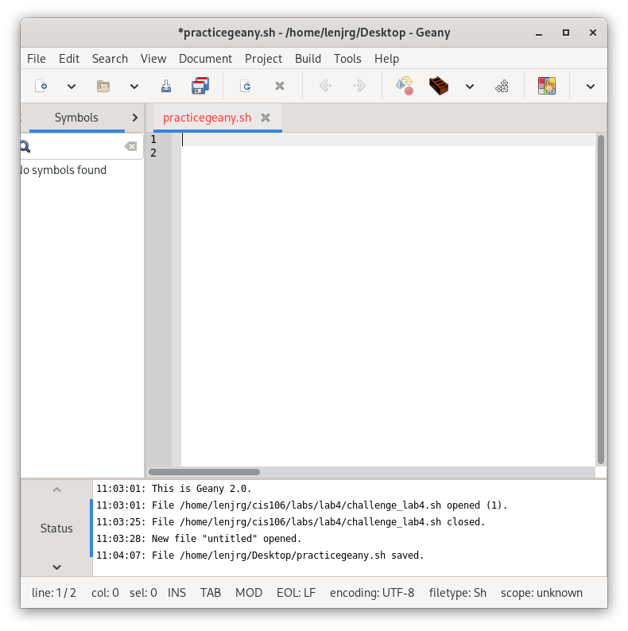

# Notes 4

### How to install and remove software using the APT command

##### To Install

1. Open terminal.
2. **Optional -** Update package list, if needed.
3. Use `install` command followed by the apt name
      * For example: `sudo` + `apt` + `install` + `bastet` 
4. Confirm Yes/No when prompted.
5. Enjoy the apt!

##### To Remove

1. Open terminal.
2. Use `remove` command followed by the apt name
    * For example: `sudo` + `apt` + `remove` + `bastet`
3. **Optional -** To completely remove a package and all its associated files use the following command
    * `sudo` + `apt` + `purge` + `bastet`

### How to create a shell script step

##### Create file
First we will start by opening a text editor software and create a new file. Give it a name followed by this extension: `.sh`

##### Add shell declaration
The first line of our file tells the system what kind of file we are writing.
We must use the following code:
`#!/bin/bash`

##### Add your code
We can now start using command lines that will be executed later
For example:
    - `echo` "Hello Class"
    - `echo` "This is my first time\nThis is my Second line"

##### Run Script
At last we will test/run our file by opening a terminal and running script by typing its directory location.
The word `bash` will always go in front of the file location.
For example:
For a file saved inside a folder named Scripts, we will run the following command line:
`bash` + `~scripts` + `file name`
