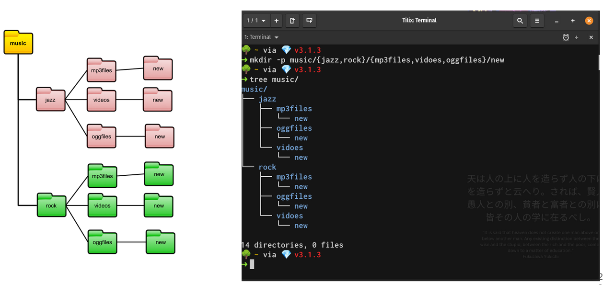

### Notes 7
#### Wildcards

**"The * Wildcard"**
The asterisk (*) matches **zero or more characters** in a filename.
Examples:
- To list all the text files in a given directory that start with letter f
  - `ls` + `Downloads/f*.txt`
- To list only CSS files in a single column:
  - `ls` + `-X1*css`
- To list all files inside a directory that contain word "random" in the name.
  - `ls` + `directory` + `/*random*`
- To move specific files from one directory to another
  - `mv` + `Downloads/Movies/{*.png,*.gif} Downloads/Movies/MCU/

**The ? Wildcard**
The ? Wildcard metacharacter matches **precisely one character.**
Examples:
- To list all hidden files in current directory:
  - `ls ./.??*`
- To list all files that have 2 characters in the filename between letters b and k
  - `ls b??k*`
- To list all files with a 2 letter file extension
  - `ls *.??`
- To list all the files in a directory that are hidden and have a 2 letter file extension
  - `ls directory/.??*??`

**The [ ] Wildcard**
The brackets wildcard matches a single character in a range.
The brackets wildcard use the exclamation mark to reverse the match.

- To match all files that have a vowel after letter f
  - `ls` + `f[aeiou]*`
- To match all files that do not have a vowel after letter f
  - `ls` + `f[aeiou]*`
- To match all files that have a range of letters after f
  - `ls` + `f[a-z]*`

#### Brace Expansion
- How to use Brace Expansion to create entire directory structures. Include at least 2 examples+
Brace expansion is a feature of the bash shell that generates argument strings.
Brace expansion does not make calls to the OS like wildcards do. They simply generate file names based on a given pattern.
To use Brace expansion:
1. Start with an open brace
2. With no spaces, type your string separating entries by a command
3. Close the brace

**Example:**
- `mkdir` `-pv` `example_site/{assets/large,docs/share,scripts/js}

To Create 3 different files with the same name but different file extensions:
- `touch` + `file.{md,txt,rtf}`
To create 10 files in a range from 0 to 9:
- `touch` + `file{0..9}.txt`
To remove specific files that start with a given keyword:
- `rm` + `image_*{01..08}*_camera.{png,jpg}`
To create an entire directory tree in a single command (1 level deep):
- `mkdir` + `-pv` + `project_venus/{code,source,dataset}/new
   